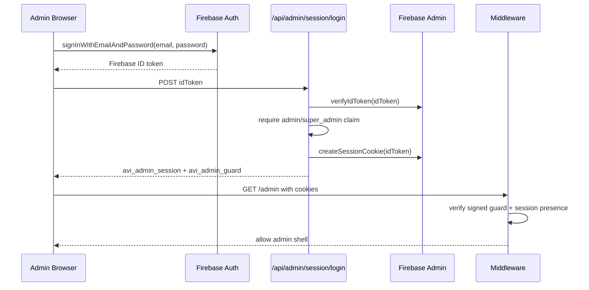
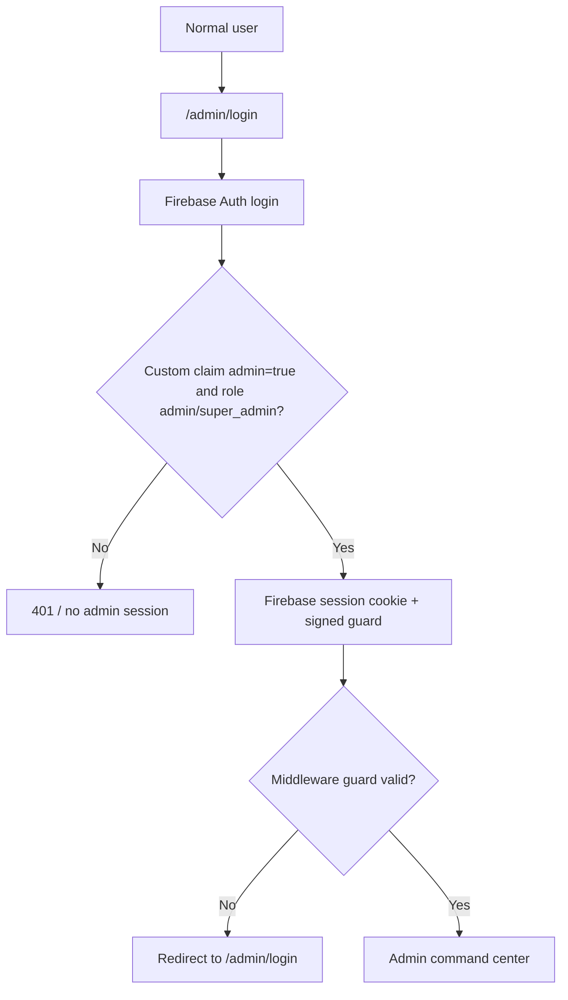

# AVI Admin Auth Foundation Report

## 1. Architecture

The admin auth foundation now uses a real Firebase Auth backed flow:

- Admin enters email/password on `/admin/login`.
- Browser signs in with Firebase Auth.
- Browser sends Firebase ID token to `/api/admin/session/login`.
- Server verifies the ID token with Firebase Admin.
- Server enforces admin custom claims or admin role.
- Server creates a Firebase session cookie named `avi_admin_session`.
- Server creates a signed edge guard cookie named `avi_admin_guard`.
- Middleware requires both cookies before allowing `/admin`.
- Admin APIs accept Firebase bearer tokens or verified Firebase session cookies.

The existing admin command center UI is preserved.

## 2. Flow Diagrams





## 3. Admin Security Model

Accepted admin roles:

- `admin`
- `super_admin`

Accepted custom-claim patterns:

- `admin: true`
- `role: "admin"`
- `role: "super_admin"`
- `adminRole: "admin"`
- `adminRole: "super_admin"`

Fallback:

- server-owned `users/{uid}.role` may be `admin` or `super_admin`

Rejected:

- normal Firebase users
- placeholder cookies
- missing cookies
- expired signed guard
- invalid session cookies
- production `ADMIN_FINTECH_DEV_TOKEN`

## 4. Session Model

Cookies:

- `avi_admin_session`
  - Firebase Admin session cookie
  - HTTP-only
  - Secure in production
  - SameSite strict
  - Path `/`

- `avi_admin_guard`
  - signed middleware guard
  - contains only `uid`, `role`, and expiry
  - HMAC signed with `ADMIN_SESSION_SECRET`, or fallback server secret
  - HTTP-only
  - Secure in production
  - SameSite strict
  - Path `/`

Why two cookies:

- Firebase session cookie is the authoritative server session for API authorization.
- Edge middleware cannot safely import Firebase Admin.
- The signed guard lets middleware reject placeholder cookies before rendering `/admin`.
- Admin APIs still verify the Firebase session cookie through Firebase Admin.

## 5. Custom Claim Model

Bootstrap script updated:

- default role is `super_admin`
- optional `ADMIN_BOOTSTRAP_ROLE=admin`
- allowed values: `admin`, `super_admin`

Claims set:

```json
{
  "admin": true,
  "role": "super_admin"
}
```

## 6. 2FA Readiness

2FA is not fully implemented yet.

Prepared hooks:

- login API returns `twoFactor.prepared: true`
- login API reserves `twoFactorCode`
- admin login UI states that TOTP is the intended second factor
- no SMS path is introduced

Future supported authenticators:

- Google Authenticator
- Microsoft Authenticator
- Authy

Recommended next phase:

- add encrypted TOTP secret storage
- add enrollment endpoint
- add challenge verification endpoint
- require TOTP for `super_admin`
- audit 2FA enrollment, success, failure, and reset

## 7. Risks

Remaining risks:

- Production admin login must be tested with a real Firebase admin user.
- `ADMIN_SESSION_SECRET` should be configured explicitly in Vercel production.
- TOTP is only prepared, not enforced.
- Admin session revocation depends on Firebase session verification and token revocation checks.
- Firestore rules/indexes still require live deploy approval before final production rollout.

## 8. Rollback Plan

If admin auth causes issues:

1. Do not deploy production.
2. If already deployed, redeploy the previous Vercel build.
3. Revert the auth foundation commit.
4. Clear admin cookies in browser.
5. Remove incorrect Firebase custom claims.
6. Revoke affected Firebase user refresh tokens.
7. Rotate `ADMIN_SESSION_SECRET` if guard signing is suspected compromised.

## Validation

Commands run:

```bash
npm.cmd run lint
npm.cmd run test
npm.cmd run build
```

Results:

- lint: passed
- tests: passed, 16 files / 52 tests
- build: passed

Runtime proof:

- `/admin/login`: `200`
- login page includes Firebase Auth language
- `/admin` with no cookie: `307` to `/admin/login`
- `/admin` with placeholder `avi_admin_session` only: `307` to `/admin/login`
- `/api/admin/fintech/products` unauthenticated: `401`
- `/api/admin/fintech/products` with dev token in production runtime: `401`
- `/api/admin/session/login` with fake token: `401`

## Verdict

Admin auth foundation is validated locally. Production is pending final gates.
